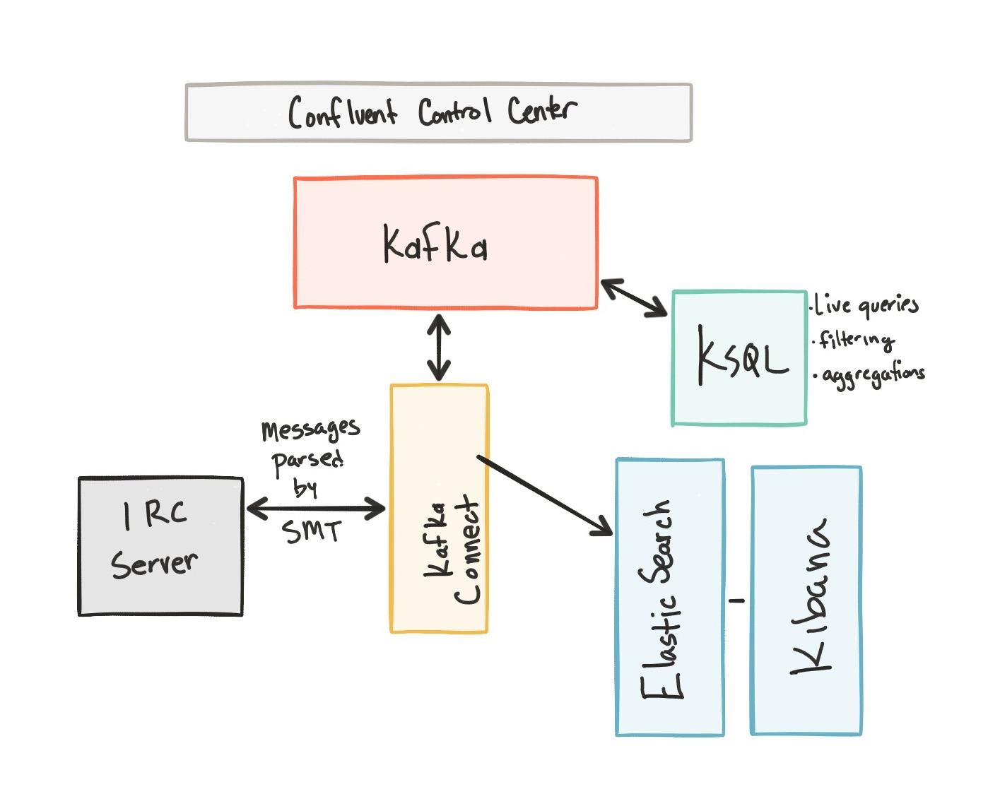

**Table of Contents**

- [Overview](#overview)
- [Installation](#installation)
- [Docker](#docker)
- [Execution](#execution)
- [Slow consumers](#slow-consumers)
- [Topic messages](#topic-messages)
- [Teardown](#teardown)

### Overview

This demo is a streaming pipeline using Apache Kafka. It connects to the Wikimedia Foundation's IRC channels (e.g. #en.wikipedia, #en.wiktionary) and streams the edits happening to Kafka via [kafka-connect-irc](https://github.com/cjmatta/kafka-connect-irc). The raw messages are transformed using a Kafka Connect Single Message Transform: [kafka-connect-transform-wikiedit](https://github.com/cjmatta/kafka-connect-transform-wikiedit) and the parsed messages are materialized into Elasticsearch for analysis by Kibana.



Components:
* [Confluent Control Center](http://docs.confluent.io/current/control-center/docs/index.html)
* [Kafka Connect](http://docs.confluent.io/current/connect/index.html)
* [Kafka Streams](http://docs.confluent.io/current/streams/index.html)
* [KSQL](https://github.com/confluentinc/ksql)
* [Confluent Schema Registry](http://docs.confluent.io/current/schema-registry/docs/index.html)
* [kafka-connect-irc source connector](https://github.com/cjmatta/kafka-connect-irc)
* [kafka-connect-elasticsearch sink connector](http://docs.confluent.io/current/connect/connect-elasticsearch/docs/elasticsearch_connector.html)
* [Elasticsearch](https://www.elastic.co/products/elasticsearch)
* [Kibana](https://www.elastic.co/products/kibana)

### Installation

1. Since this repository uses submodules, clone with `--recursive`:

```
$ git clone --recursive git@github.com:confluentinc/ConfluentPlatformWikipediaDemo.git
```

Otherwise, git clone and then submodule init/update:

```
$ git clone git@github.com:confluentinc/ConfluentPlatformWikipediaDemo.git
$ cd ConfluentPlatformWikipediaDemo
$ git submodule init
Submodule 'kafka-connect-irc' (https://github.com/cjmatta/kafka-connect-irc) registered for path 'kafka-connect-irc'
Submodule 'kafka-connect-transform-wikiedit' (https://github.com/cjmatta/kafka-connect-transform-wikiedit) registered for path 'kafka-connect-transform-wikiedit'
$ git submodule update
```

2. Increase the memory available to Docker. Default is 2GB, increase to at least 6GB.

3. Run `make clean all` to build the IRC connector and the transformer that will parse the Wikipedia edit messages to data. These are saved to `connect-plugins` path, which is a shared volume to the `connect` docker container

```bash
$ make clean all
...
$ ls connect-plugins
```

### Docker

1. Start Docker Compose. It will take about 2 minutes for all containers to start and for Confluent Control Center GUI to be ready.

```bash
$ docker-compose up -d
```

2. Wait till Confluent Control Center is running fully.  You can check when it's ready when the logs show the following event

```bash
$ docker-compose logs -f control-center | grep -e HTTP
control-center_1       | [2017-09-06 16:37:33,133] INFO Started NetworkTrafficServerConnector@26a529dc{HTTP/1.1}{0.0.0.0:9021} (org.eclipse.jetty.server.NetworkTrafficServerConnector)
```

### Execution

Now you must decide how you want to run the demo, whether you want to run data either:

* Straight through Kafka from Wikipedia IRC to Elasticsearch without KSQL. The connectors use Schema Registry and Avro.

```bash
$ export DEMOPATH=scripts_no_app
```

or

* From Wikipedia IRC to Elasticsearch with KSQL. The connectors  use Json instead of Avro because KSQL does not support Avro with Schema Registry at this time.

```bash
$ export DEMOPATH=scripts_ksql_app
```

1. Setup the cluster and connectors

```bash
$ ./$DEMOPATH/setup.sh
```

2. If you are demo'ing KSQL.

2a. Start KSQL

```bash
$ docker-compose exec ksql-cli ksql-cli local --bootstrap-server kafka:9092 --properties-file /tmp/ksqlproperties
```

2b. Run saved KSQL commands which generates an output topic that feeds into the Elasticsearch sink connector.

```bash
ksql> run script '/tmp/ksqlcommands';
```

2c. Leave KSQL application open for the duration of the demo to keep Kafka clients running. If you close KSQL, data processing will stop.

3. Open Kibana [http://localhost:5601/](http://localhost:5601/).

4. Navigate to "Management --> Saved Objects" and click `Import`. Then choose of these two options:

* If you are running traffic straight from Wikipedia IRC to Elasticsearch _without KSQL_, then load the `scripts_no_app/kibana_dash.json` file
* If you are running traffic from Wikipedia IRC _through KSQL_ to Elasticsearch, then load the `scripts_ksql_app/kibana_dash.json` file

8. Click "Yes, overwrite all".

9. Navigate to the Dashboard tab (speedometer icon) and open your new dashboard.

10. Use Google Chrome to view the Control Center GUI at [http://localhost:9021](http://localhost:9021) and see the message delivery status, consumer groups, connectors.


### Slow Consumers

To simulate a slow consumer, we will use Kafka's quota feature to rate-limit consumption from the broker side.

1. Start consuming from topic `wikipedia.parsed` with a new consumer group `app` which has two consumers `consumer_app_1` and `consumer_app_2`. It will run in the background.

```bash
$ ./$DEMOPATH/start_consumer_app.sh
```

2. Let the above consumers run for a while until it has steady consumption.

3. Add a consumption quota for one of the consumers in the consumer group `app`

```bash
$ ./$DEMOPATH/throttle_consumer.sh 1 add
```

4. View in C3 how this one consumer starts to lag.

5. Remove the consumption quota for the consumer.

```bash
$ ./$DEMOPATH/throttle_consumer.sh 1 delete
```

6. Stop consuming from topic `wikipedia.parsed` with a new consumer group `app`.

```bash
$ ./$DEMOPATH/stop_consumer_app.sh
```

### Topic Messages

In a different terminal, watch the live messages from the `wikipedia.parsed` topic:

```bash
$ ./$DEMOPATH/listen_wikipedia.parsed.sh
```

In a different terminal, watch the SMT failed messages (poison pill routing) from the `wikipedia.failed` topic:

```bash
$ ./$DEMOPATH/listen_wikipedia.failed.sh
```


### Teardown
Stop and destroy all components and clear all volumes from Docker.

```bash
$ ./$DEMOPATH/reset_demo.sh
```
